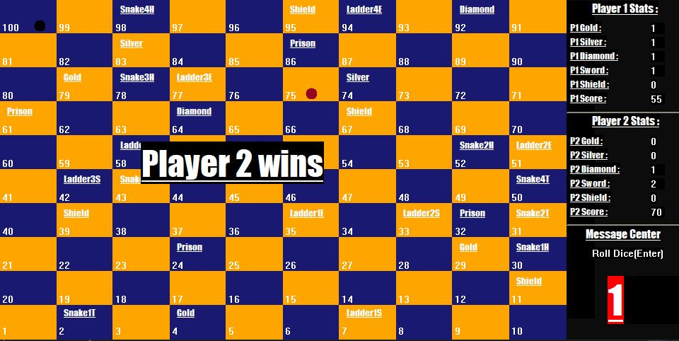

# SnakesAndLadders

A classic Snakes and Ladders game built in C++ with some additional challenges. Add graphic files in project and compile Souce.cpp

# Controls:

- Press Enter to roll dice
- Enter 1 or 2 for player move
- Enter p for picking up things
- Enter l for leaving things
- Enter first letter of a thing to use it when needed (In prison) i.e. s for Sword
- Enter Esc for saving game

# ScreenShots:

